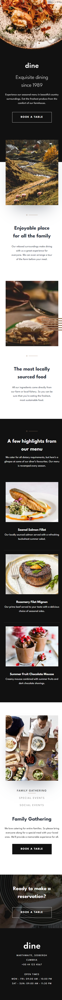
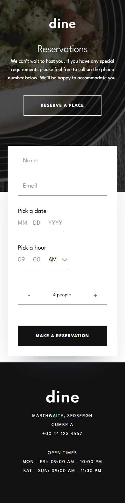
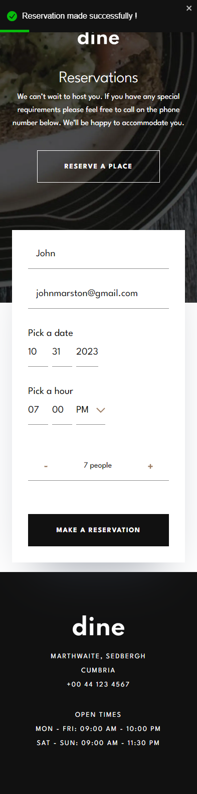

<h1 align="center">🥘🥖Dine Restaurant</h1>

<h4 align="center">
    This project is a challenge that I took from <a href="https://www.frontendmentor.io/challenges/photosnap-multipage-website-nMDSrNmNW">frontendmentor.io </a> 
    which consists of building a responsible restaurant website where you can make a reservation
    through a great form. 
</h4>
 

<h4 align="center">
    <a align="center" href="https://www.frontendmentor.io/solutions/responsive-designo-website-project-using-react-next-and-tailwind-7-QAd_C_Na">Front-end mentor challenge.</a> //
     <a align="center" href="https://designo-multi-page-website-hazel.vercel.app/">Audiophile Website</a>
</h4>

 

<h6 align="center"> This project was created with:</h6>
 
 

    
    
    
    
 

  

<!-- Desktop -->
<h2 align="center">Desktop Version 🖥️</h2>

<!-- Mobile -->
<h2 align="center">Mobile Version 📱</h2>

<!--Made By Gustavo J. Souza -->